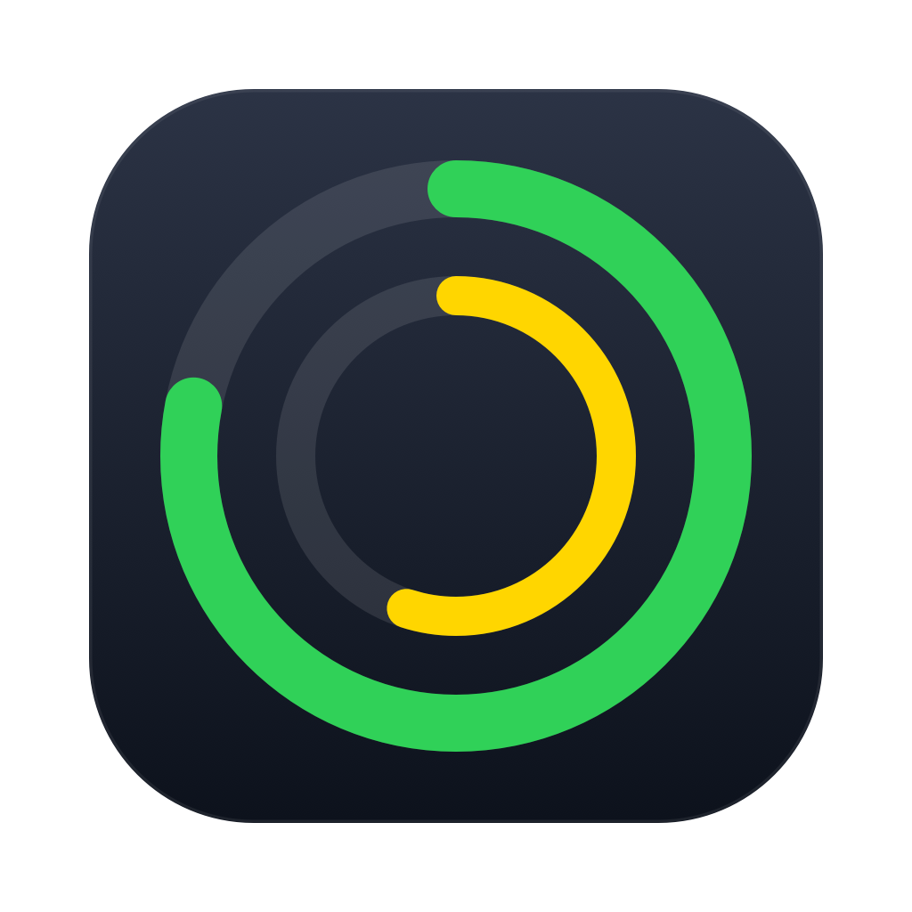
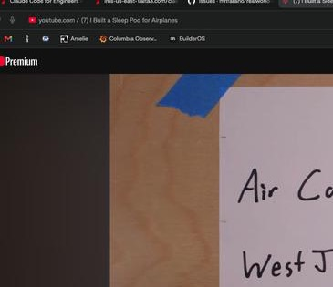

<div align="center">

# QuotaBar

**Every AI quota you're burning through, in one menu-bar glyph.**

Z.AI coding plan, Claude Pro/Max, Codex, GitHub — each hides its usage in a
different dashboard. QuotaBar shows them all as one quiet 20×20 ring in your
menu bar that only speaks up when you're about to run out.

[](https://github.com/mrlfarano/QuotaBar/releases/latest)
[](https://github.com/mrlfarano/QuotaBar/actions/workflows/ci.yml)
[](LICENSE)






*One menu, every provider — bars, reset countdowns, which source drives the
rings, and Settings behind its own submenu. This fresh install has no
Z.AI token, so the bar shows GitHub's rings — a healthy provider takes
over instead of an auth warning.*

</div>

---

## Why

AI subscriptions each gate you differently: Z.AI's coding plan has a 5-hour
and a weekly token window, Claude Max the same on a different clock, Codex
again, GitHub rate-limits your API calls. Checking four dashboards to answer
*"can I keep working?"* is silly.

QuotaBar answers it at a glance:

```
Status bar:  [◎ dual ring: outer = 5h, inner = weekly] ↻9h24m
             green shows only the reset countdown (↻ = time until reset);
             yellow/red add the colored percent (41% · ↻43m, 8% · ↻12m ⚠︎)
```

- **Green** — you're fine; see only the time until reset.
- **Yellow** — colored percent appears. **Red** — percent + warning glyph.
- Click for the full menu: per-provider bars, token counts where the API
  gives them, reset countdowns, and the raw response one keystroke away.

## Providers

| Source | Shows | Credential | Endpoint |
|--------|-------|------------|----------|
| **Z.AI Coding Plan** (`zai`) | 5h + weekly token windows, MCP monthly, per-model detail | browser token — **auto-discovered** from browser localStorage, or paste | reverse-engineered |
| **Claude Pro/Max** (`claude`) | 5h + weekly utilization | Claude Code's OAuth session | reverse-engineered |
| **Codex / ChatGPT** (`codex`) | 5h + weekly windows, plan tier | Codex CLI's stored token | reverse-engineered |
| **GitHub Copilot** (`copilot`) | monthly premium requests used vs entitlement | opencode/VS Code auth files, or paste | reverse-engineered |
| **Antigravity** (`antigravity`) | Gemini + Claude/GPT pool quotas, plan tier | none — reads the app's local endpoint | local (app must run) |
| **OpenRouter** (`openrouter`) | credits used vs limit (USD) | `OPENROUTER_API_KEY` or paste | official |
| **GitHub** (`github`) | API core rate limit | optional `GH_TOKEN` | official |
| **Custom** (n many) | any JSON with used/limit (+reset) | whatever you configure | yours |

A **Windows port** (system-tray app, same sources/parsers/config/glyph)
lives in [`windows/`](windows/README.md).

The **Status Bar Source** picker decides whose numbers drive the rings;
anything that fails falls back to the next healthy provider — error states
included, so one broken login never hides the others. When nothing is
healthy, the bar shows a short ⚠︎ warning naming the failing source.

### Auto-discovery

At launch (and via **Discover Sources**, ⌘D) QuotaBar scans for credentials
you already have on disk and enables the matching sources:

- **z.ai's browser token** — the z.ai site keeps its API token in browser
  localStorage (`z-ai-open-platform-token-production`); QuotaBar reads it
  from every Chromium-family browser's on-disk storage (Chrome, Canary,
  Chromium, Brave, Edge, Arc, Comet) and from Firefox — no copy-paste, no
  Keychain. Safari's storage is TCC-protected and deliberately never read.
- `~/.claude/.credentials.json` → `claude` — and when Claude Code is
  pointed at the GLM coding plan (`ANTHROPIC_BASE_URL` on z.ai), its
  `ANTHROPIC_AUTH_TOKEN` is picked up for `zai` instead
- `~/.codex/auth.json` → `codex`
- opencode `~/.local/share/opencode/auth.json` or VS Code
  `~/.config/github-copilot/{hosts,apps}.json` → `copilot`
- `OPENROUTER_API_KEY` / `GH_TOKEN` / `GITHUB_TOKEN` env vars →
  `openrouter` / `github`
- Antigravity's app data dir → `antigravity` (local-only source)

It never overwrites tokens you set manually, never touches sources you
disabled, and never reads the Keychain. CLI auth files are re-read live, so
when Claude Code or Codex refreshes their own login, QuotaBar follows along.

## Install

**Download** the latest [release](https://github.com/mrlfarano/QuotaBar/releases/latest)
and drag `QuotaBar.app` anywhere convenient (launch-at-login installs it to
`~/Applications`). The bundle is unsigned, so the first launch needs one of:

```sh
xattr -cr QuotaBar.app        # or: right-click → Open (twice)
```

Then use **Install at Login** if you want it at every boot:

```sh
scripts/install-login.sh      # builds, copies to ~/Applications, adds LaunchAgent
scripts/uninstall-login.sh    # removes the agent
```

**Build from source** (Xcode toolchain with Swift 5.9, no dependencies):

```sh
git clone https://github.com/mrlfarano/QuotaBar.git
cd QuotaBar
swift build -c release
.build/release/quotabar --demo      # synthetic gauges, no credentials needed
```

## Configuration

Everything lives in `~/.quotabar/config.json` (0600) — most of it is managed
through the menu:

```jsonc
{
  "zaiToken": "…",              // menu key field "Z.AI" stores this
  "pollMinutes": 5,             // all sources poll on this cadence
  "mainSource": "zai",          // Status Bar Source picker
  "sources": {
    "zai":    { "enabled": true },         // absent = enabled
    "github": { "enabled": true, "token": "" },
    "claude": { "enabled": true, "discovered": true },
    "codex":  { "enabled": true, "discovered": true },
    "custom": [{
      "id": "openrouter", "title": "OpenRouter credits",
      "url": "https://openrouter.ai/api/v1/credits",
      "token": "sk-or-…",
      "usedPath": "data.usage", "limitPath": "data.limit",
      "resetPath": "data.reset_at"
    }]
  }
}
```

Custom sources walk the response with dot paths (`items.0.left` — dict keys
and integer array indices); `token` is sent as `Authorization: Bearer …`,
extra headers via `"headers": {…}`, and `resetPath` accepts epoch seconds,
epoch milliseconds, or ISO8601. Missing `usedPath` defaults to 0; a custom
source renders exactly like a built-in, no recompile.

**Settings** live behind their own **Settings… ▸** submenu in the dropdown
(⌘, opens it) — poll-cadence radios, per-source on/off checkboxes (Z.AI
included, so the app is fully usable without a Z.AI account), and the
directly pasted keys (Z.AI, GitHub, OpenRouter). Each checkbox carries a
one-line status that speaks up when something's wrong (fetch error, missing
credentials context, or a pending first fetch). The menu stays open while
you adjust; every change applies live — saved back to the same 0600 file,
with sources refreshed immediately (a change landing mid-refresh re-runs
it) — and the data rows catch up when the menu closes. Stored keys are
masked (`********` + last 5 characters); clicking a key field clears it for
a fresh paste, leaving it empty keeps the stored value, and the × button
removes a key outright. Toggling a source never touches its stored
credentials. Custom sources and the OAuth-managed tokens stay JSON-first
via **Open config.json…**. The menu footer shows the running version.

## Color bands

Applied to quota **remaining** (battery metaphor — red means you're about to
run out):

| Remaining | Used | Color |
|-----------|------|-------|
| ≥ 76% | ≤ 24% | 🟢 green |
| 26–75% | 25–74% | 🟡 yellow |
| ≤ 25% | ≥ 75% | 🔴 red |

Thresholds live in `UsageBand.of(remainingPct:)` in
`Sources/quotabar/Visualization.swift`.

## Honesty section

The Z.AI, Claude, Codex, and Copilot endpoints are **not public APIs** —
they're what each vendor's own dashboard/CLI/IDE calls, captured and pinned
in [`plans/`](plans/). They work today and can change tomorrow; when they
do, the affected source shows an error row instead of lying with stale
numbers. Antigravity quota comes from the app's own local endpoint and only
while the app runs; OpenRouter and GitHub use official APIs. QuotaBar reads
only usage endpoints, stores everything locally (`~/.quotabar/`, 0600), and
never writes to the CLIs' own credential files.

## Development

```sh
swift build -c release
swift test                           # unit tests (Tests/quotabarTests/)
.build/release/quotabar --demo        # synthetic data, offline
.build/release/quotabar --probe [zai|claude|codex|copilot|openrouter|antigravity]
.build/release/quotabar --parse testdata/payload_real.json        # offline parser checks
.build/release/quotabar --parse-claude testdata/claude-usage.json
.build/release/quotabar --parse-codex testdata/codex-usage.json
.build/release/quotabar --parse-copilot testdata/copilot-user.json
.build/release/quotabar --parse-openrouter testdata/openrouter-credits.json
.build/release/quotabar --parse-antigravity testdata/antigravity-userstatus.json
scripts/make-icon.sh                # regenerate Resources/AppIcon.icns
```

Project layout: `Sources/quotabar/` — one `enum XSource` per provider
(fetch → `SourceSection`, never throws), `Visualization.swift` for the
ring glyph and menu text, `Discovery.swift` for credential scanning,
fixtures in `testdata/`. More in [CONTRIBUTING.md](CONTRIBUTING.md).

## Roadmap

- Official cost APIs as budget gauges: Anthropic Admin `cost_report`,
  OpenAI `/v1/organization/costs` vs a monthly limit, OpenRouter credits.
- In-app OAuth sign-in for Z.AI (drop the copy-from-browser step).

## Contributing

Issues and PRs welcome — see [CONTRIBUTING.md](CONTRIBUTING.md).
Good first issues: new providers behind the existing `SourceSection`
pattern (the [feature request template](.github/ISSUE_TEMPLATE/feature_request.yml)
explains what captures a new endpoint).

## License

[MIT](LICENSE) © Luis Arano. QuotaBar is not affiliated with Z.AI, Anthropic,
OpenAI, or GitHub.
