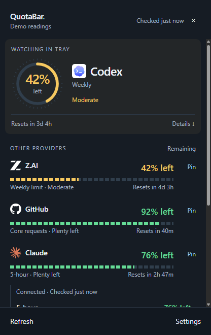

# QuotaBar for Windows

The Windows port of QuotaBar: the same sources, parsers, config format,
color bands, and dual-ring glyph as the macOS menu-bar app, living in the
Windows **system tray** (notification area) instead of the menu bar.
Windows **0.12.0** adds the Instrument usage panel. Download the portable
archive from the [Windows release](https://github.com/mrlfarano/QuotaBar/releases/tag/windows-v0.12.0),
extract the whole folder, and launch `QuotaBar.exe`.



Left-click the tray icon to open the panel. Click a provider for all quota
windows, select which window drives its tray ring, or **Pin** another provider.
Hover or focus reset times for the exact local date. **Settings** contains update
cadence, manual mode, pause/resume, start at login, and optional alerts for the
pinned quota. Alerts start disabled; recovery requires a new successful reading.
**Manage connections** offers retry and access to credential settings.

Details expand and retract smoothly; Windows reduced-motion preferences disable
transitions. Logos are bundled locally. Closing the panel destroys its renderer;
there are no background UI animation timers. Refreshes use one scheduled timeout
and reuse tray images when quota values have not changed. See the
[resource measurements](../docs/windows-performance.md) for measured limits.

Right-click retains the native menu and advanced Settings window. Windows-only
preferences and sanitized last-known readings live beside the shared config in
`windows-preferences.json` and `windows-readings.json`. Unavailable or old readings
are marked explicitly; a reset timestamp never invents replenished quota.

- **Same logic** — every provider source (Z.AI, Claude, Codex, Copilot,
  Antigravity, OpenRouter, GitHub, custom dot-path sources), the pinned +
  adaptive Z.AI parsers, credential auto-discovery (including the z.ai
  browser-localStorage scan and the Claude Code bridge), the refresh-token
  chains, healthy-fallback status resolution, refresh coalescing, and the
  `~/.quotabar/config.json` format are line-faithful ports of
  `Sources/quotabar/`. The offline `--parse*` outputs are byte-identical to
  the Swift binary on the shared fixtures in `../testdata/` (CI enforces
  this on every push), and the snapshot cache
  (`~/.quotabar/last-snapshot.json`) is interchangeable with the macOS
  app's. `sources.zai` round-trips cleanly between the two apps.
- **Familiar tray glyph** — concentric dual rings
  (outer = selected quota, inner = next quota, band colors, filling clockwise
  from 12 o'clock), with the colorblind-safe red center dot and the tray
  menu mirroring the macOS menu: section headers, block-bar gauge rows
  (padded to the longest current label), token counts, reset countdowns,
  clamped titles/errors, the Status Bar Source picker, Refresh Now, Copy
  Raw Response, Discover Sources, Settings…, and the version row.

## Platform differences (honest list)

| macOS | Windows |
|-------|---------|
| Menu-bar item shows glyph **+ text** (`41% · ↻43m ⚠︎`) | Tray icons are icon-only on Windows — the glyph's colors + red dot carry the band, and the escalation numbers (`↻` countdowns, `%`, ⚠︎), ring legend, and per-gauge "% left" live in the live-updating tooltip |
| Attributed menu text (colored bars/percents inline) | Native menus can't color text; each gauge row carries a band-colored ring icon next to the mono block bar |
| Inline settings in the dropdown + a small key editor | Usage panel with quick settings and connection status; separate General, Sources, and Advanced settings for credentials and configuration. |
| `NSAlert` discovery results | Discovery refreshes silently; configuration lives in Settings |
| z.ai token scan: `~/Library/Application Support` browser roots | Same byte-level scan across `%LOCALAPPDATA%` Chromium roots (Chrome, Canary, Chromium, Brave, Edge, Arc, Comet) + Firefox's `%APPDATA%` webappsstore.sqlite; Edge-protected stores are never read |
| Antigravity process scan via `ps`/`lsof` | Same scan via `Get-CimInstance` / `Get-NetTCPConnection` (netstat fallback) |
| LaunchAgent via `scripts/install-login.sh` | **Start at login** checkbox in Settings (registry-backed via `app.setLoginItemSettings`) |
| config saved 0600 | `chmod 600` is a no-op on NTFS; the file sits in your profile folder — set ACLs yourself if you share the machine |
| VoiceOver labels on gauge rows | Custom panel exposes labeled meters, buttons, keyboard focus, and collapsed-state semantics. The native fallback menu still has Electron's per-item accessibility limitations. |

## Configure the app

Open **Settings…** from the tray menu. **General** contains Start at login,
refresh interval, and tray-source selection. **Sources** contains provider toggles
and common keys. These settings apply immediately. **Discover Sources** scans credentials
and refreshes the tray without opening a results alert.

Use **Advanced** for the Z.AI base URL
and authorization prefix, provider access/refresh tokens and account IDs, and
custom sources. Custom sources support a URL, bearer token, request headers,
used/limit paths, and an optional reset field. Use **Save changes** to
validate and apply these edits; **Discard** restores saved values.

Blank secret fields retain stored credentials, including tokens refreshed while
Settings was open. **Clear** explicitly removes a credential. Custom headers stay
hidden: enter a JSON object to replace them, or `{}` to clear them. Invalid input
and save failures appear inline and retain the draft. CLI credential files are
never edited. **Open configuration file** remains available for direct file access.

Start at login reads the named Windows startup entry and verifies changes after
saving. Development runs use a separate entry that includes the app path.

## Run from source

Requires [Node.js](https://nodejs.org) ≥ 22.12 (Electron 44's tooling requirement). No runtime npm dependencies;
Electron is a dev dependency only.

```sh
cd windows
npm install
npm start             # real sources
npm run demo          # synthetic gauges, offline
npm test              # unit tests (ports of Tests/quotabarTests/)
node src/cli.js --parse ../testdata/payload_real.json   # offline parser checks
```

## Tests

Run from `windows/` after `npm ci`:

| Command | Coverage |
| --- | --- |
| `npm test` | Unit and integration tests: parsers, provider HTTP/auth flows, config/cache persistence, discovery, CLI subprocesses, PNG/ICO assets |
| `npm run test:coverage` | Node/V8 coverage report for those tests; excludes Electron renderer coverage |
| `npm run test:electron` | Windows-only real Electron tray/menu, settings DOM, preload IPC, credential editing, login toggle, and window lifecycle checks |
| `npm run test:all` | Node suite plus Electron integration |
| `npm run test:package` | Windows-only smoke tests against an existing `out/QuotaBar-win32-x64/QuotaBar.exe`: PE architecture and every offline parser flag |
| `npm run test:windows` | Full Windows gate: Node + Electron tests, fresh package, packaged executable checks |
| `npm run test:live` | Opt-in check of locally available provider sessions; prints only status/counts, persists rotated OAuth credentials in QuotaBar config |

Tests use Node's built-in runner and installed Electron; no additional test
dependencies. Provider requests use synthetic responses, HTTP transport tests
use loopback servers, and credential/config tests use temporary profiles.
Electron windows stay hidden; login settings are intercepted without changing
the Windows registry. No real credentials or provider accounts are required.
Electron binaries may download on first use; packaging may also require network.

Add `test/*.test.js` for core regressions and shared sanitized provider payloads
under `../testdata/`. Electron scenarios live in `test/electron/runner.mjs`;
packaged executable checks live in `test/package/`. CI and releases run all three
layers. Coverage reports measure loaded Node modules, not overall GUI coverage;
no numeric coverage threshold is enforced.

CI captures stdout, stderr, and exit status for all eleven Swift fixture commands
on macOS, then compares Windows Node output against that artifact using
`scripts/parser-parity.js`. Any difference fails CI. Both PRs and pushes to
`main` run this gate.

`test:live` is separate from automated CI. It reads existing credentials and
performs normal provider requests; discovery results remain in memory. Successful
OAuth rotations are saved to QuotaBar's config, never the CLI's credential files.
Unavailable accounts or a stopped Antigravity app are reported explicitly.

If a running packaged app locks `out/`, use another output directory for both
packaging and smoke tests (PowerShell):

```powershell
$env:QUOTABAR_PACKAGE_OUT = Join-Path $env:TEMP 'quotabar-test-build'
npm run test:windows
```

The Electron suite creates and removes one uniquely named temporary Windows
startup entry to verify registration without changing the installed app's entry.

Manual release checks remain necessary for actual tray placement/DPI appearance,
keyboard/screen-reader behavior, real Windows login registration, and live-provider
compatibility.

## Package a Windows build

```sh
cd windows
npm run package:win   # → out/QuotaBar-win32-x64/QuotaBar.exe
```

`scripts/package-win.js` regenerates `build/QuotaBar.ico` from the shared
`docs/icon-1024.png` (pure-Node PNG decode + box downscale, no wine), then
`@electron/packager` downloads the prebuilt win32 Electron and brands the
exe (icon, `ProductName`, version — the `VERSION=vX.Y.Z` env overrides the
package.json version, mirroring the macOS `make-app.sh`). Works from
macOS/Linux too. The unpacked folder (or its zip) is the deliverable: copy
`QuotaBar-win32-x64/` anywhere and run `QuotaBar.exe`. The binary is
unsigned, so SmartScreen shows "more info → Run anyway" on first launch;
every `v*` tag attaches the Windows zip to the GitHub release
automatically.

## Layout

```
src/
  main.js            entry: --demo/--parse*/--probe dispatch, then the tray app
  trayapp.js         port of main.swift's AppDelegate: tray, menu, polling, cache
  ringicon.js        the dual-ring glyph rasterizer (same geometry as Visualization.swift, red center dot included)
  png.js             dependency-free PNG encoder for the glyphs
  cli.js             offline --parse*/--probe checks (byte-parity with the Swift binary)
  settingswindow.js  Settings… window (poll cadence, per-source toggles + status lines, keys, start at login)
  core/              the portable logic: config, parsers, sources, discovery,
                     statusdisplay (fallback + refresh coalescing), format,
                     zaitoken (browser localStorage scan)
test/                ports of Tests/quotabarTests/ (node --test)
scripts/             packaging (make-ico.js, package-win.js)
```

`npm start` also runs on macOS/Linux for development — handy for verifying
changes without a Windows box, as the glyphs and menus are drawn by the
shared code.
